# SyqueX — Database Schema Reference

> **Version:** 1.1.0 · **Last Updated:** 2026-06-02 · **Engine:** PostgreSQL 16 · **Extensions:** pgvector  
> **ORM:** SQLAlchemy 2.0 (async) · **Driver:** asyncpg

---

## Entity-Relationship Diagram

```mermaid
erDiagram
    psychologists ||--o{ patients : "has many"
    psychologists ||--o| subscriptions : "has one"
    psychologists ||--o{ refresh_tokens : "has many"
    psychologists ||--o{ password_reset_tokens : "has many"
    psychologists ||--o{ audit_logs : "has many"
    psychologists ||--o| note_templates : "has one"
    psychologists ||--o{ availability_slots : "has many"
    patients ||--o{ sessions : "has many"
    patients ||--o| patient_profiles : "has one"
    patients ||--o| patient_users : "has one"
    sessions ||--o| clinical_notes : "has one"
    sessions ||--o| patient_summaries : "has one"
    patient_users ||--o{ patient_password_reset_tokens : "has many"

    psychologists {
        uuid id PK
        varchar name
        varchar email UK
        varchar password_hash
        boolean is_active
        varchar cedula_profesional
        varchar specialty
        timestamptz accepted_privacy_at
        timestamptz accepted_terms_at
        varchar privacy_version
        varchar terms_version
        timestamptz trial_ends_at
        varchar stripe_customer_id
        timestamptz created_at
        timestamptz updated_at
    }

    patients {
        uuid id PK
        uuid psychologist_id FK
        varchar name
        date date_of_birth
        text[] diagnosis_tags
        varchar risk_level
        varchar marital_status
        varchar occupation
        text address
        text emergency_contact
        text reason_for_consultation
        text medical_history
        text psychological_history
        text gender_identity
        text phone
        varchar email
        timestamptz created_at
        timestamptz updated_at
        timestamptz deleted_at
    }

    sessions {
        uuid id PK
        uuid patient_id FK
        integer session_number
        date session_date
        text raw_dictation
        varchar format
        text ai_response
        varchar status
        boolean is_archived
        text messages
        timestamptz created_at
        timestamptz updated_at
    }

    clinical_notes {
        uuid id PK
        uuid session_id FK_UK
        varchar format
        text subjective
        text objective
        text assessment
        text plan
        text data_field
        text[] detected_patterns
        text[] alerts
        text[] suggested_next_steps
        jsonb evolution_delta
        jsonb custom_fields
        jsonb template_snapshot
        vector_1024 embedding
        timestamptz created_at
        timestamptz updated_at
    }

    patient_profiles {
        uuid id PK
        uuid patient_id FK_UK
        text[] recurring_themes
        text[] protective_factors
        text[] risk_factors
        jsonb progress_indicators
        text patient_summary
        timestamptz updated_at
    }

    patient_users {
        uuid id PK
        uuid patient_id FK
        uuid psychologist_id FK
        varchar email UK
        text password_hash
        varchar invite_token
        timestamptz invite_token_expires_at
        timestamptz invited_at
        timestamptz accepted_at
        boolean is_active
    }

    patient_summaries {
        uuid id PK
        uuid session_id FK_UK
        uuid patient_id FK
        text ai_draft
        text topics_worked
        text homework
        date next_session_date
        timestamptz sent_at
        timestamptz viewed_at
        timestamptz created_at
        timestamptz updated_at
    }

    patient_password_reset_tokens {
        uuid id PK
        uuid patient_user_id FK
        varchar token_hash UK
        timestamptz expires_at
        timestamptz used_at
        integer failed_attempts
        varchar ip_address
        timestamptz created_at
    }

    note_templates {
        uuid id PK
        uuid psychologist_id FK_UK
        jsonb fields
        timestamptz created_at
        timestamptz updated_at
    }

    job_queue {
        uuid id PK
        uuid psychologist_id
        uuid patient_id FK
        varchar status
        varchar format
        text raw_dictation
        jsonb template_fields
        text result
        text error_message
        integer attempts
        timestamptz created_at
        timestamptz updated_at
    }

    subscriptions {
        uuid id PK
        uuid psychologist_id FK
        varchar plan_slug
        integer price_mxn_cents
        varchar status
        varchar stripe_subscription_id UK
        varchar stripe_price_id
        timestamptz current_period_start
        timestamptz current_period_end
        boolean cancel_at_period_end
        timestamptz canceled_at
        timestamptz created_at
        timestamptz updated_at
    }

    refresh_tokens {
        uuid id PK
        uuid psychologist_id FK
        varchar token_hash UK
        timestamptz expires_at
        timestamptz revoked_at
        varchar ip_address
        text user_agent
        timestamptz created_at
    }

    password_reset_tokens {
        uuid id PK
        uuid psychologist_id FK
        varchar token_hash UK
        timestamptz expires_at
        timestamptz used_at
        integer failed_attempts
        varchar ip_address
        timestamptz created_at
    }

    audit_logs {
        uuid id PK
        timestamptz timestamp
        uuid psychologist_id
        varchar action
        varchar entity
        varchar entity_id
        varchar ip_address
        jsonb extra
    }

    availability_slots {
        uuid id PK
        uuid psychologist_id FK
        date slot_date
        time start_time
        integer duration_minutes
        varchar status
        uuid booked_by_patient_id FK
        timestamptz booked_at
        varchar cancelled_by
        boolean acknowledged
        timestamptz created_at
        timestamptz updated_at
    }

    processed_stripe_events {
        varchar id PK
        timestamptz created_at
    }
```

---

## Table Details

### `psychologists`

The user/tenant table. Each psychologist owns their patients and data.

| Column | Type | Constraints | Notes |
|---|---|---|---|
| `id` | UUID | PK, default `uuid4()` | |
| `name` | VARCHAR(255) | NOT NULL | |
| `email` | VARCHAR(255) | UNIQUE, NOT NULL | Login identifier |
| `password_hash` | VARCHAR(255) | NULLABLE | bcrypt hash (12 rounds) |
| `is_active` | BOOLEAN | NOT NULL, default `true` | Account status |
| `cedula_profesional` | VARCHAR(20) | NULLABLE | Mexican professional license |
| `specialty` | VARCHAR(100) | NULLABLE | Clinical specialty |
| `accepted_privacy_at` | TIMESTAMPTZ | NULLABLE | LFPDPPP consent timestamp |
| `accepted_terms_at` | TIMESTAMPTZ | NULLABLE | Terms consent timestamp |
| `privacy_version` | VARCHAR(10) | NULLABLE | Version of privacy policy accepted |
| `terms_version` | VARCHAR(10) | NULLABLE | Version of terms accepted |
| `trial_ends_at` | TIMESTAMPTZ | NULLABLE | Trial expiration (registration + 14 days) |
| `stripe_customer_id` | VARCHAR(50) | NULLABLE | Stripe Customer ID |
| `created_at` | TIMESTAMP | NOT NULL | |
| `updated_at` | TIMESTAMP | NOT NULL | |

---

### `patients`

Patient records, scoped per psychologist. Campos de intake clínico cifrados con Fernet.

| Column | Type | Constraints | Notes |
|---|---|---|---|
| `id` | UUID | PK | |
| `psychologist_id` | UUID | FK → psychologists.id (RESTRICT) | |
| `name` | VARCHAR(255) | NOT NULL | |
| `date_of_birth` | DATE | NULLABLE | |
| `diagnosis_tags` | TEXT[] | default `[]` | Array of diagnostic labels |
| `risk_level` | VARCHAR(20) | NOT NULL, CHECK `IN ('low','medium','high')` | |
| `marital_status` | VARCHAR(30) | NULLABLE | Estado civil |
| `occupation` | VARCHAR(120) | NULLABLE | Ocupación |
| `address` | TEXT | NULLABLE | Dirección |
| `emergency_contact` | TEXT | NULLABLE | JSON cifrado `{name, relationship, phone}` |
| `reason_for_consultation` | TEXT | NULLABLE | Motivo de consulta |
| `medical_history` | TEXT | NULLABLE | Historial médico |
| `psychological_history` | TEXT | NULLABLE | Historial psicológico previo |
| `gender_identity` | TEXT | NULLABLE | Identidad de género |
| `phone` | TEXT | NULLABLE | Teléfono |
| `email` | VARCHAR(255) | NULLABLE | Para envío de resúmenes / invitación portal |
| `created_at` | TIMESTAMPTZ | NOT NULL | |
| `updated_at` | TIMESTAMPTZ | NOT NULL | |
| `deleted_at` | TIMESTAMPTZ | NULLABLE | Soft delete LFPDPPP compliance |

**Indexes:**
- `idx_patients_psychologist_id` — lookup by owner
- `idx_patients_active` — partial index where `deleted_at IS NULL`

---

### `sessions`

Raw dictation and AI response for each clinical encounter.

| Column | Type | Constraints | Notes |
|---|---|---|---|
| `id` | UUID | PK | |
| `patient_id` | UUID | FK → patients.id (RESTRICT) | |
| `session_number` | INTEGER | NULLABLE | Null para sesiones de chat libre |
| `session_date` | DATE | NOT NULL | |
| `raw_dictation` | TEXT | NOT NULL | Original clinician input |
| `format` | VARCHAR(20) | NOT NULL, default `'SOAP'` | `SOAP`, `DAP`, `BIRP`, `chat`, `custom` |
| `ai_response` | TEXT | NULLABLE | Claude's raw text response |
| `status` | VARCHAR(20) | NOT NULL, CHECK `IN ('draft','confirmed')` | |
| `is_archived` | BOOLEAN | NOT NULL, default `false` | Soft-hide from UI |
| `messages` | TEXT | NOT NULL, default `'[]'` | Turns cifrados `[{role, content}]` (Fernet) |
| `created_at` | TIMESTAMPTZ | NOT NULL | |
| `updated_at` | TIMESTAMPTZ | NOT NULL | |

**Indexes:**
- `idx_sessions_patient_id` — lookup by patient
- `idx_sessions_session_date` — chronological queries
- `idx_sessions_patient_date` — composite: patient + date
- `idx_sessions_active` — partial index where `is_archived = FALSE`

---

### `clinical_notes`

Structured clinical notes with vector embeddings. One-to-one with sessions.

| Column | Type | Constraints | Notes |
|---|---|---|---|
| `id` | UUID | PK | |
| `session_id` | UUID | FK → sessions.id (CASCADE), UNIQUE | One note per session |
| `format` | VARCHAR(20) | NOT NULL, CHECK `IN ('SOAP','DAP','BIRP')` | |
| `subjective` | TEXT | NULLABLE | S in SOAP |
| `objective` | TEXT | NULLABLE | O in SOAP |
| `assessment` | TEXT | NULLABLE | A in SOAP |
| `plan` | TEXT | NULLABLE | P in SOAP |
| `data_field` | TEXT | NULLABLE | D in DAP (avoids `data` keyword) |
| `detected_patterns` | TEXT[] | default `[]` | AI-detected clinical patterns |
| `alerts` | TEXT[] | default `[]` | Risk/safety alerts |
| `suggested_next_steps` | TEXT[] | default `[]` | Therapeutic recommendations |
| `evolution_delta` | JSONB | default `{}` | Change metrics from prior session |
| `custom_fields` | JSONB | NULLABLE | Campos llenados para formato custom |
| `template_snapshot` | JSONB | NULLABLE | Snapshot de la plantilla al momento de crear la nota (evita "Sin información" si el psicólogo modifica su template) |
| `embedding` | VECTOR(1024) | NULLABLE | FastEmbed multilingual-e5-large |
| `created_at` | TIMESTAMPTZ | NOT NULL | |
| `updated_at` | TIMESTAMPTZ | NOT NULL | |

> **format CHECK:** `IN ('SOAP', 'DAP', 'BIRP', 'custom')`

**Indexes:**
- `clinical_notes_embedding_idx` — HNSW index for cosine distance (`vector_cosine_ops`)

---

### `patient_profiles`

Longitudinal clinical summary. One-to-one with patients.

| Column | Type | Constraints | Notes |
|---|---|---|---|
| `id` | UUID | PK | |
| `patient_id` | UUID | FK → patients.id (CASCADE), UNIQUE | |
| `recurring_themes` | TEXT[] | default `[]` | Topics across sessions |
| `protective_factors` | TEXT[] | default `[]` | Positive clinical indicators |
| `risk_factors` | TEXT[] | default `[]` | Risk indicators |
| `progress_indicators` | JSONB | default `{}` | Structured progress metrics |
| `patient_summary` | TEXT | NULLABLE | Claude-generated clinical summary (max ~300 words) |
| `updated_at` | TIMESTAMP | NOT NULL | |

**Indexes:**
- `idx_patient_profiles_patient_id`

---

### `availability_slots`

Psychologist calendar slots for booking.

| Column | Type | Constraints | Notes |
|---|---|---|---|
| `id` | UUID | PK | |
| `psychologist_id` | UUID | FK → psychologists.id (CASCADE) | |
| `slot_date` | DATE | NOT NULL | e.g. 2026-05-15 |
| `start_time` | TIME | NOT NULL | e.g. 10:00 |
| `duration_minutes` | INTEGER | NOT NULL, CHECK `15 ≤ x ≤ 180`, default 60 | |
| `status` | VARCHAR(20) | NOT NULL, CHECK `IN ('available','booked','cancelled')` | |
| `booked_by_patient_id` | UUID | FK → patients.id (SET NULL) | |
| `booked_at` | TIMESTAMPTZ | NULLABLE | |
| `cancelled_by` | VARCHAR(20) | NULLABLE | `'psychologist'` o `'patient'` |
| `acknowledged` | BOOLEAN | NOT NULL, default `false` | Psicólogo confirmó la cancelación en UI |
| `created_at` | TIMESTAMPTZ | NOT NULL | |
| `updated_at` | TIMESTAMPTZ | NOT NULL | |

**Indexes:**
- `idx_slots_psychologist_date` — lookup por psicólogo + fecha
- `idx_slots_psychologist_status` — lookup por psicólogo + estado
- `idx_slots_booked_patient` — lookup por paciente
- `uq_psychologist_slot` — UNIQUE (psychologist_id, slot_date, start_time)

---

### `subscriptions`

SaaS billing records tied to Stripe.

| Column | Type | Constraints | Notes |
|---|---|---|---|
| `id` | UUID | PK | |
| `psychologist_id` | UUID | FK → psychologists.id (RESTRICT) | |
| `plan_slug` | VARCHAR(50) | NOT NULL | e.g. `pro_v1` |
| `price_mxn_cents` | INTEGER | NOT NULL | Price in MXN centavos (49900 = $499 MXN) |
| `status` | VARCHAR(20) | NOT NULL, CHECK `IN (...)` | `trialing`, `active`, `past_due`, `canceled`, `unpaid` |
| `stripe_subscription_id` | VARCHAR(100) | UNIQUE, NULLABLE | Stripe Subscription ID |
| `stripe_price_id` | VARCHAR(100) | NULLABLE | Stripe Price ID |
| `current_period_start` | TIMESTAMPTZ | NULLABLE | |
| `current_period_end` | TIMESTAMPTZ | NULLABLE | |
| `cancel_at_period_end` | BOOLEAN | NOT NULL, default `false` | |
| `canceled_at` | TIMESTAMPTZ | NULLABLE | |
| `created_at` | TIMESTAMPTZ | NOT NULL | |
| `updated_at` | TIMESTAMPTZ | NOT NULL | |

**Indexes:**
- `idx_subscriptions_psychologist_id`
- `idx_subscriptions_status`

---

### `refresh_tokens`

JWT refresh token records for secure rotation.

| Column | Type | Constraints | Notes |
|---|---|---|---|
| `id` | UUID | PK | |
| `psychologist_id` | UUID | FK → psychologists.id (CASCADE) | |
| `token_hash` | VARCHAR(64) | UNIQUE | SHA-256 of the raw token. Never store raw. |
| `expires_at` | TIMESTAMPTZ | NOT NULL | 7-day TTL |
| `revoked_at` | TIMESTAMPTZ | NULLABLE | Set on rotation or logout |
| `ip_address` | VARCHAR(45) | NULLABLE | IPv4/IPv6 |
| `user_agent` | TEXT | NULLABLE | Browser user-agent |
| `created_at` | TIMESTAMPTZ | NOT NULL | |

**Stolen Token Detection:** If a token with `revoked_at IS NOT NULL` is presented, ALL tokens for that psychologist are immediately revoked.

---

### `password_reset_tokens`

One-time-use password reset tokens.

| Column | Type | Constraints | Notes |
|---|---|---|---|
| `id` | UUID | PK | |
| `psychologist_id` | UUID | FK → psychologists.id (CASCADE) | |
| `token_hash` | VARCHAR(64) | UNIQUE | SHA-256 of the raw token |
| `expires_at` | TIMESTAMPTZ | NOT NULL | 60-minute TTL |
| `used_at` | TIMESTAMPTZ | NULLABLE | Set when password is successfully reset |
| `failed_attempts` | INTEGER | NOT NULL, default `0` | Max 3, then token is blocked |
| `ip_address` | VARCHAR(45) | NULLABLE | |
| `created_at` | TIMESTAMPTZ | NOT NULL | |

---

### `audit_logs`

Immutable audit trail for LFPDPPP compliance.

| Column | Type | Constraints | Notes |
|---|---|---|---|
| `id` | UUID | PK | |
| `timestamp` | TIMESTAMP | NOT NULL | Event time |
| `psychologist_id` | UUID | NULLABLE | Actor (null for system events) |
| `action` | VARCHAR(50) | NOT NULL | `register`, `login`, `logout`, `password_reset_*`, `CREATE`, `READ`, `UPDATE`, `DELETE` |
| `entity` | VARCHAR(50) | NOT NULL | `psychologist`, `patient`, `session`, `clinical_note`, `auth` |
| `entity_id` | VARCHAR(36) | NULLABLE | Affected entity UUID |
| `ip_address` | VARCHAR(45) | NULLABLE | |
| `extra` | JSONB | NULLABLE | **NEVER store clinical data here.** Only IDs and counters. |

**Indexes:**
- `idx_audit_logs_psychologist_id`
- `idx_audit_logs_timestamp`
- `idx_audit_logs_entity`
- `idx_audit_logs_action`
- `idx_audit_logs_psych_timestamp` — composite for querying actions per user in a time range

---

### `patient_users`

Cuentas de pacientes para el portal del paciente.

| Column | Type | Constraints | Notes |
|---|---|---|---|
| `id` | UUID | PK | |
| `patient_id` | UUID | FK → patients.id (CASCADE) | |
| `psychologist_id` | UUID | FK → psychologists.id | |
| `email` | VARCHAR(255) | UNIQUE, NOT NULL | Login del paciente |
| `password_hash` | TEXT | NULLABLE | Null hasta que el paciente acepta la invitación |
| `invite_token` | VARCHAR(255) | NULLABLE, indexed | Token one-time de aceptación (7 días) |
| `invite_token_expires_at` | TIMESTAMPTZ | NULLABLE | |
| `invited_at` | TIMESTAMPTZ | NOT NULL | Cuando se envió la invitación |
| `accepted_at` | TIMESTAMPTZ | NULLABLE | Cuando el paciente creó su contraseña |
| `is_active` | BOOLEAN | NOT NULL, default `false` | Se activa al aceptar la invitación |

**Indexes:**
- `idx_patient_users_patient` — lookup by patient_id
- `idx_patient_users_psychologist` — lookup by psychologist_id
- UNIQUE on `email`
- Index on `invite_token`

---

### `patient_summaries`

Resúmenes de sesión generados por IA y enviados al portal del paciente.

| Column | Type | Constraints | Notes |
|---|---|---|---|
| `id` | UUID | PK | |
| `session_id` | UUID | FK → sessions.id (CASCADE), UNIQUE | Un resumen por sesión |
| `patient_id` | UUID | FK → patients.id | |
| `ai_draft` | TEXT | NULLABLE | Borrador generado por Claude |
| `topics_worked` | TEXT | NULLABLE | Temas trabajados en la sesión |
| `homework` | TEXT | NULLABLE | Tareas asignadas al paciente |
| `next_session_date` | DATE | NULLABLE | Fecha de la próxima cita |
| `sent_at` | TIMESTAMPTZ | NULLABLE | Cuándo se envió al paciente |
| `viewed_at` | TIMESTAMPTZ | NULLABLE | Cuándo lo vio el paciente |
| `created_at` | TIMESTAMPTZ | NOT NULL | |
| `updated_at` | TIMESTAMPTZ | NOT NULL | |

**Indexes:**
- `idx_patient_summaries_patient` — lookup by patient
- `idx_patient_summaries_session` — lookup by session

---

### `patient_password_reset_tokens`

Tokens one-time para reset de contraseña de cuentas de pacientes.

| Column | Type | Constraints | Notes |
|---|---|---|---|
| `id` | UUID | PK | |
| `patient_user_id` | UUID | FK → patient_users.id (CASCADE) | |
| `token_hash` | VARCHAR(64) | UNIQUE | SHA-256 del token raw |
| `expires_at` | TIMESTAMPTZ | NOT NULL | TTL 60 minutos |
| `used_at` | TIMESTAMPTZ | NULLABLE | Set al usar el token |
| `failed_attempts` | INTEGER | NOT NULL, default `0` | Máx 3, luego bloqueado |
| `ip_address` | VARCHAR(45) | NULLABLE | |
| `created_at` | TIMESTAMPTZ | NOT NULL | |

**Indexes:**
- `idx_patient_password_reset_tokens_hash`

---

### `note_templates`

Plantillas de nota clínica personalizadas por psicólogo.

| Column | Type | Constraints | Notes |
|---|---|---|---|
| `id` | UUID | PK | |
| `psychologist_id` | UUID | FK → psychologists.id (CASCADE), UNIQUE | Una plantilla por psicólogo |
| `fields` | JSONB | NOT NULL, default `[]` | Array de campos: `{id, label, type, required}` |
| `created_at` | TIMESTAMPTZ | NOT NULL | |
| `updated_at` | TIMESTAMPTZ | NOT NULL | |

**Format de `fields`:**
```json
[
  { "id": "motivo", "label": "Motivo de consulta", "type": "textarea", "required": true },
  { "id": "escala_ansiedad", "label": "Escala ansiedad (0-10)", "type": "number", "required": false }
]
```

---

### `job_queue`

Cola de jobs asíncronos para procesar dictados que requieren tiempo.

| Column | Type | Constraints | Notes |
|---|---|---|---|
| `id` | UUID | PK | |
| `psychologist_id` | UUID | NOT NULL | Sin FK explícita (alta velocidad de insert) |
| `patient_id` | UUID | FK → patients.id (RESTRICT) | |
| `status` | VARCHAR(20) | NOT NULL, CHECK `IN ('pending','processing','completed','failed')` | |
| `format` | VARCHAR(20) | NOT NULL, default `'SOAP'` | Formato de nota solicitado |
| `raw_dictation` | TEXT | NOT NULL | Dictado cifrado con Fernet |
| `template_fields` | JSONB | NULLABLE | Campos del template custom si aplica |
| `result` | TEXT | NULLABLE | JSON cifrado con el resultado de Claude |
| `error_message` | TEXT | NULLABLE | Mensaje de error si `status='failed'` |
| `attempts` | INTEGER | NOT NULL, default `0` | Máx 3 intentos antes de fallar |
| `created_at` | TIMESTAMPTZ | NOT NULL | |
| `updated_at` | TIMESTAMPTZ | NOT NULL | |

**Indexes:**
- `idx_job_queue_status_created` — worker poll: `WHERE status='pending' ORDER BY created_at`
- `idx_job_queue_psychologist_id` — lookup por psicólogo

---

### `processed_stripe_events`

Idempotency table for Stripe webhook processing.

| Column | Type | Constraints | Notes |
|---|---|---|---|
| `id` | VARCHAR(100) | PK | Stripe event ID (e.g. `evt_...`) |
| `created_at` | TIMESTAMPTZ | NOT NULL | When processed |

---

## Migration Strategy

The project uses **startup-time idempotent migrations** in `database.py:init_db()` rather than a dedicated migration tool (like Alembic). Each migration statement is wrapped in `IF NOT EXISTS` or `DO $$ ... END$$` blocks.

```mermaid
graph LR
    Startup["App Startup"] --> InitDB["init_db()"]
    InitDB --> CreateExt["CREATE EXTENSION IF NOT EXISTS vector"]
    CreateExt --> CreateAll["Base.metadata.create_all()"]
    CreateAll --> Migrations["Idempotent ALTER TABLE<br/>IF NOT EXISTS / DO $$ block"]
    Migrations --> Constraints["CHECK constraints<br/>(IF NOT EXISTS)"]
    Constraints --> Indexes["CREATE INDEX IF NOT EXISTS"]
    Indexes --> VectorMigration["Embedding dimension migration<br/>1536 to 1024"]
    VectorMigration --> HNSWIndex["CREATE HNSW INDEX<br/>vector_cosine_ops"]

    style InitDB fill:#5a9e8a,stroke:#18181b,color:#fff
    style HNSWIndex fill:#c4935a,stroke:#18181b,color:#fff
```



> [!IMPORTANT]
> Alembic is listed in `requirements.txt` but not actively used for migrations. The current approach works for a single-developer team but should be migrated to Alembic for production multi-developer workflows.

---

## Vector Search Details

### Embedding Model
- **Model:** `intfloat/multilingual-e5-large` via FastEmbed
- **Dimensions:** 1024
- **Rationale:** Multilingual (Spanish clinical text), runs locally (no PII egress)

### Index Type
- **Type:** HNSW (Hierarchical Navigable Small World)
- **Distance:** Cosine (`vector_cosine_ops`)
- **Query Operator:** `<=>` (cosine distance, lower = more similar)

### Search Query Pattern
```sql
SELECT s.session_number, s.session_date, cn.assessment,
       1 - (cn.embedding <=> :embedding::vector) as relevance_score
FROM clinical_notes cn
JOIN sessions s ON cn.session_id = s.id
WHERE s.patient_id = :patient_id
ORDER BY cn.embedding <=> :embedding::vector
LIMIT :limit
```
